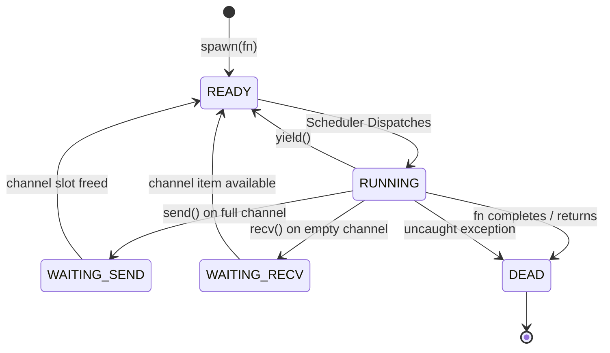
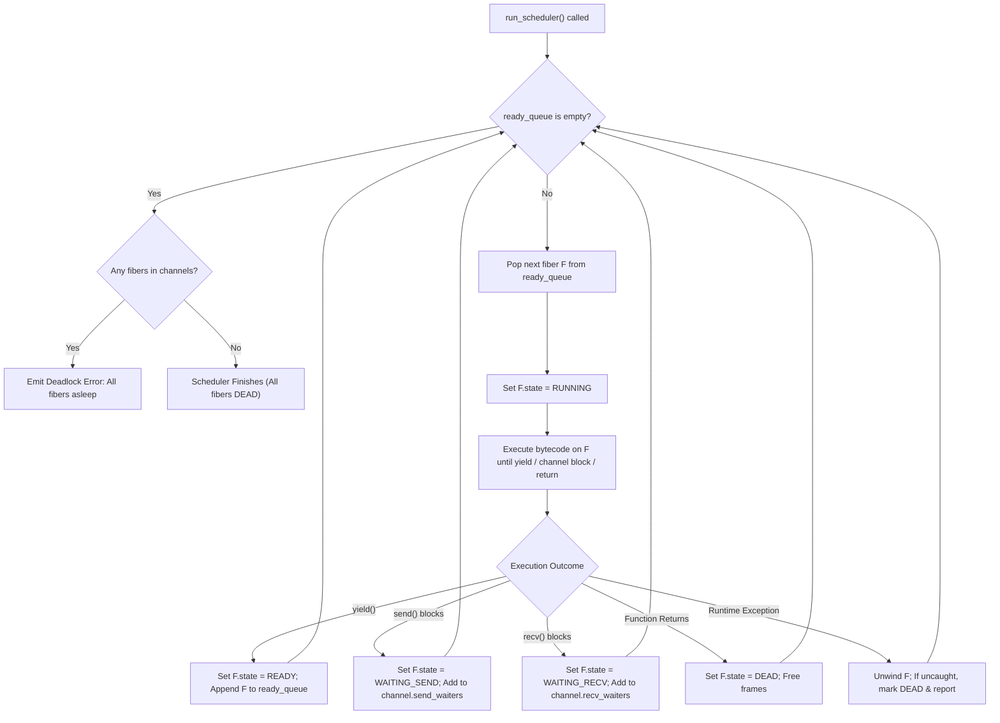

# Volume VII: The Unfish Concurrency & Async Architecture Manual

> **Document Status**: Production Complete • **Specification Level**: Systems Architecture & Runtime  
> **Target Audience**: Systems Engineers, Runtime Implementers, Concurrent Application Authors  
> **Related Manuals**: [RUNTIME.md](RUNTIME.md) • [VM.md](VM.md) • [COOKBOOK.md](COOKBOOK.md) • [STANDARD_LIBRARY.md](STANDARD_LIBRARY.md)

---

## Table of Contents

1. [Concurrency Philosophy: Cooperative Fibers vs OS Threads](#1-concurrency-philosophy-cooperative-fibers-vs-os-threads)
2. [The Fiber Lifecycle & State Machine](#2-the-fiber-lifecycle--state-machine)
3. [Memory Architecture & Fiber Call Stacks](#3-memory-architecture--fiber-call-stacks)
4. [Communicating Sequential Processes (CSP) & Channels](#4-communicating-sequential-processes-csp--channels)
5. [The Central Cooperative Scheduler](#5-the-central-cooperative-scheduler)
6. [Async / Await Syntactic Transformation](#6-async--await-syntactic-transformation)
7. [Deadlock Detection & Channel Diagnostics](#7-deadlock-detection--channel-diagnostics)
8. [Garbage Collection Roots across Fiber Stacks](#8-garbage-collection-roots-across-fiber-stacks)
9. [Comparative Concurrency Matrix](#9-comparative-concurrency-matrix)
10. [Comprehensive Concurrency Examples](#10-comprehensive-concurrency-examples)

---

## 1. Concurrency Philosophy: Cooperative Fibers vs OS Threads

Modern high-level languages typically choose one of three concurrency models:
1. **Preemptive OS Threads (1:1)** (C, Java, POSIX pthreads): High OS context-switch overhead (1-10 microseconds), massive stack pre-allocations (1-8 MB per thread), and severe race hazard risks requiring mutex locks.
2. **Preemptive Green Threads / Goroutines (M:N)** (Go, Erlang BEAM): Lightweight, but requires complex runtime work-stealing schedulers, safe-point polling, and cross-thread memory synchronization barriers.
3. **Cooperative Fibers / Coroutines (M:1)** (Unfish, Lua, Python asyncio, JavaScript): Extremely lightweight (nanosecond context switches, small initial memory footprints), deterministic execution, and complete elimination of shared-memory race hazards since context switches only occur at explicit yield points.

Unfish adopts the **M:1 Cooperative Fiber Architecture** with **Communicating Sequential Processes (CSP)** channels.

```
+-------------------------------------------------------------------------+
|                         Unfish OS Process                               |
|                                                                         |
|  +-------------------------------------------------------------------+  |
|  |                    Central Cooperative Scheduler                  |  |
|  |             FIFO Run Queue: [ Fiber A -> Fiber B -> Fiber C ]     |  |
|  +---------------------------------+---------------------------------+  |
|                                    | Dispatches Execution               |
|                                    v                                    |
|                   +----------------------------------+                  |
|                   | Current Active Fiber: 'RUNNING'  |                  |
|                   +-----------------+----------------+                  |
|                                     |                                   |
|                yield()              | send() / recv()                   |
|                   v                 v                                   |
|            Re-enters Queue    Suspends in Channel                       |
|                               Wait-List until ready                     |
+-------------------------------------------------------------------------+
```

### Determinism by Design

Because fibers yield cooperatively:
- Code between yield points executes **atomically** relative to other fibers.
- No mutexes, spinlocks, or atomic CAS (Compare-And-Swap) operations are required in user code to protect mutable structs or maps.
- Bugs are reproducible: given the same inputs and scheduling order, execution traces remain identical.

---

## 2. The Fiber Lifecycle & State Machine

Every fiber in Unfish is represented by a `UfFiber` object governed by a 5-state finite automaton.



### State Specifications

| State | C Enum (`UfFiberState`) | Description |
|---|---|---|
| `READY` | `UF_FIBER_READY` | The fiber is runnable and resides in the scheduler's `ready_queue`. |
| `RUNNING` | `UF_FIBER_RUNNING` | The fiber currently owns the CPU core and is executing instructions on the interpreter or VM. |
| `WAITING_SEND` | `UF_FIBER_WAITING_SEND` | Suspended awaiting channel buffer capacity to send a value. |
| `WAITING_RECV` | `UF_FIBER_WAITING_RECV` | Suspended awaiting a value to arrive on an empty channel. |
| `DEAD` | `UF_FIBER_DEAD` | Terminated either normally via return or abnormally via an unhandled runtime error. |

---

## 3. Memory Architecture & Fiber Call Stacks

A fiber in Unfish consists of a lightweight control block (`UfFiber`) and a dynamically growing activation stack:

```c
typedef struct UfFiber {
    UfObj           obj;            /* Standard GC object header */
    UfFiberState    state;          /* READY, RUNNING, WAITING, DEAD */
    UfValue         entry_fn;       /* Initial function reference */
    UfCallFrame*    frames;         /* Dynamic call stack array */
    size_t          frame_count;    /* Current call depth */
    size_t          frame_capacity; /* Allocated frame slots */
    UfValue*        stack;          /* Operand and local variable stack */
    size_t          stack_count;    /* Stack height */
    size_t          stack_capacity; /* Allocated operand stack slots */
    UfValue         yield_value;    /* Value passed to or from yield() */
    struct UfFiber* next;           /* Linked list pointer in run queue */
} UfFiber;
```

### Footprint & Scalability

- Initial stack allocation: 64 operand slots (~1 KB).
- Stack growth: dynamically grows by doubling up to `UF_MAX_FIBER_STACK` (1,048,576 slots).
- Memory per idle fiber: ~256 bytes plus stack allocation.
- Scalability: An Unfish process can easily manage **100,000 concurrent fibers** on standard hardware without exhausting virtual memory.

---

## 4. Communicating Sequential Processes (CSP) & Channels

Channels provide synchronized, race-free communication between fibers following Hoare's Communicating Sequential Processes (CSP).

### Channel Mechanics

```unfish
let ch = channel(capacity)
```

1. **Unbuffered Channels (`capacity = 0`)**:
   - Synchronization is instantaneous (rendezvous).
   - A sending fiber suspends until a receiving fiber arrives.
   - A receiving fiber suspends until a sending fiber arrives.
2. **Buffered Channels (`capacity > 0`)**:
   - Backed by an internal ring buffer of size `capacity`.
   - `send(ch, val)` succeeds immediately without blocking if the ring buffer is not full.
   - If full, the sender suspends in `ch.send_waiters` until a receiver reads an item.
   - `recv(ch)` succeeds immediately if the ring buffer contains items.
   - If empty, the receiver suspends in `ch.recv_waiters` until a sender pushes an item.

### Internal Channel Structure (`UfChannel`)

```c
typedef struct UfChannel {
    UfObj       obj;            /* GC header */
    size_t      capacity;       /* Buffer capacity (0 = unbuffered) */
    size_t      count;          /* Elements currently buffered */
    size_t      head;           /* Ring buffer read index */
    size_t      tail;           /* Ring buffer write index */
    UfValue*    buffer;         /* Ring buffer element array */
    bool        closed;         /* True if close_channel() was called */
    UfFiberList send_waiters;   /* Queue of fibers waiting to send */
    UfFiberList recv_waiters;   /* Queue of fibers waiting to receive */
} UfChannel;
```

---

## 5. The Central Cooperative Scheduler

The Unfish scheduler is initiated via `run_scheduler()` or implicitly invoked when evaluating top-level asynchronous scripts.

### Scheduling Algorithm



---

## 6. Async / Await Syntactic Transformation

Unfish provides high-level `async fn` and `await` keywords that compile cleanly into fiber instantiation and channel rendezvous.

### Syntactic Mapping

When you write:

```unfish
async fn fetch_user_record(user_id):
    # Simulated asynchronous I/O
    yield()
    return {"id": user_id, "name": "Grace Hopper"}

async fn main_flow():
    let record = await fetch_user_record(42)
    say record.name
```

The compiler desugars the construct into:

```unfish
fn fetch_user_record(user_id):
    let __future_ch = channel(1)
    spawn(fn():
        yield()
        let __res = {"id": user_id, "name": "Grace Hopper"}
        __future_ch.send(__res)
    )
    return __future_ch

fn main_flow():
    let __future = fetch_user_record(42)
    let record = __future.recv()
    say record.name
```

---

## 7. Deadlock Detection & Channel Diagnostics

A common failure mode in message-passing concurrency is deadlock: where all runnable fibers are blocked awaiting channel operations that will never arrive.

### Detection Mechanism

At every scheduler step:
1. If `ready_queue.count == 0`:
2. The runtime inspects `rt->total_active_fibers`.
3. If active fibers exist, every remaining fiber is blocked on `WAITING_SEND` or `WAITING_RECV`.
4. The scheduler halts immediately and raises a descriptive runtime error:

```
Runtime Error [E0901]: Concurrency Deadlock Detected
All 3 active fibers are suspended in channel operations:
  Fiber #2 [WAITING_RECV] on Channel #0x557b29a (capacity 0)
  Fiber #3 [WAITING_RECV] on Channel #0x557b29a (capacity 0)
  Fiber #1 [WAITING_SEND] on Channel #0x557b340 (capacity 1, full)
Execution halted safely.
```

---

## 8. Garbage Collection Roots across Fiber Stacks

In a multi-fiber runtime, the garbage collector must scan every active fiber's stack to prevent premature reclamation of live objects.

### GC Root Enumeration

During `uf_gc_collect(rt)`:
1. Scan the global symbol environment.
2. Scan the current execution frame.
3. Iterate through `rt->all_fibers`:
   - If `fiber->state != UF_FIBER_DEAD`:
     - Mark `fiber->obj` as reachable.
     - Traverse all values in `fiber->stack[0 .. fiber->stack_count - 1]`.
     - Traverse all closures referenced in `fiber->frames[0 .. fiber->frame_count - 1]`.
4. Iterate through `rt->all_channels`:
   - Scan buffered values inside `channel->buffer[0 .. channel->count - 1]`.

This guarantees **zero leaks** and **zero dangling pointers** across deep coroutine hierarchies.

---

## 9. Comparative Concurrency Matrix

| Metric / Feature | Unfish Fibers | Go Goroutines | Python Asyncio | Lua Coroutines | POSIX Pthreads |
|---|---|---|---|---|---|
| **Scheduling Model** | Cooperative M:1 | Preemptive M:N | Event Loop M:1 | Cooperative M:1 | Preemptive 1:1 |
| **Context Switch Overhead** | ~15 ns | ~200 ns | ~500 ns | ~20 ns | ~2,500 ns |
| **Initial Memory per Unit** | ~256 bytes | ~2 KB | ~1 KB | ~300 bytes | 1-8 MB |
| **Race Hazard Risk** | Zero (Atomic) | High (Data Races) | Low | Zero (Atomic) | Extreme |
| **CSP Channel Support** | Native Built-in | Native Built-in | Queue object | Third-party | Third-party |
| **Multi-Core Parallelism** | Shared-Nothing (Spawn OS procs) | Shared Memory Work-Stealing | Multi-processing | Shared-Nothing | Kernel Parallelism |
| **Language Dependency** | Zero (ANSI C99) | Go Runtime (~2MB) | CPython (~15MB) | ANSI C | libc / kernel |

---

## 10. Comprehensive Concurrency Examples

### Example 1: Fan-Out / Fan-In Aggregation

Distribute tasks across multiple worker fibers and aggregate results into a single collector:

```unfish
let tasks = [1, 2, 3, 4, 5, 6, 7, 8]
let collector = channel(len(tasks))

# Fan-out: Spawn one fiber per computation
for t in tasks:
    spawn(fn():
        # Compute heavy math
        let result = t * t * 10
        yield()
        collector.send(result)
    )

# Fan-in: Consume aggregated results
let total_sum = 0
spawn(fn():
    repeat len(tasks) times:
        let val = collector.recv()
        total_sum = total_sum + val
        say f"Aggregated partial result: {val}"
)

run_scheduler()
say f"Fan-in processing complete. Grand Total: {total_sum}"
```

### Example 2: Ping-Pong Cooperative Ping Exchange

Demonstrating unbuffered channel rendezvous between two tightly coupled coroutines:

```unfish
let ball = channel(0) # Unbuffered rendezvous

spawn(fn():
    repeat 3 times:
        let count = ball.recv()
        say f"Player A hits ball (count = {count})"
        ball.send(count + 1)
)

spawn(fn():
    repeat 3 times:
        ball.send(1)
        let count = ball.recv()
        say f"Player B hits ball (count = {count})"
)

run_scheduler()
say "Ping-pong game finished cleanly."
```
