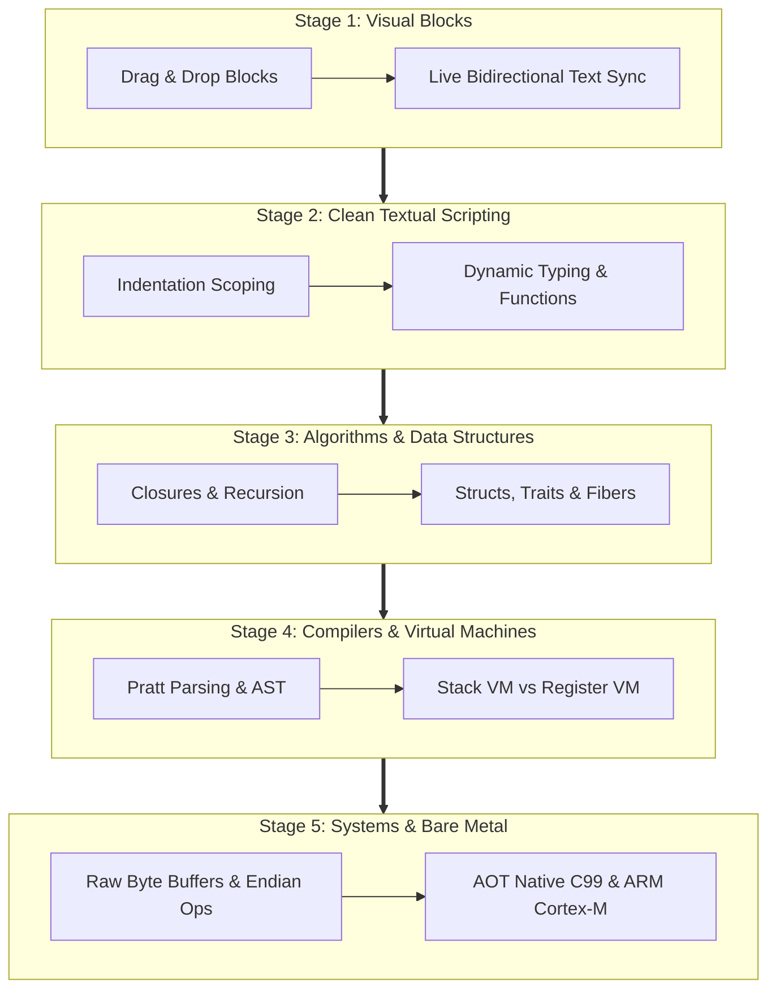

# UNFISH — THE ARCHITECTURAL VISION, PHILOSOPHY & PEDAGOGICAL MANIFESTO
## The Definitive Treatise on the Unbroken Path of Computing Education

> *"A learner can begin programming visually in Unfish, transition naturally into textual Unfish, and eventually use the exact same language to master advanced programming, algorithms, virtual machine design, compiler engineering, operating systems, networking, and bare-metal embedded systems."*

---

## 1. Executive Summary: What is the Main Aim of Unfish?

The primary aim of **Unfish** is to provide the world's first **unbroken, zero-friction continuum for computer science education and systems engineering**.

For half a century, the path from novice to master software engineer has been artificially fractured by incompatible tools, incompatible mental models, and artificial pedagogical walls. Students begin in visual block environments (Scratch, Blockly) where they are taught algorithmic sequences in a sandbox devoid of real-world capabilities. When they attempt to transition to industry languages (Python, Java, C++), they hit an immediate wall of cognitive overload: cryptic compilation errors, complex project tooling, and confusing punctuation noise. Later, when they must learn low-level computer architecture, operating systems, and memory management, they hit another wall: high-level languages treat the hardware as an opaque "black box," forcing students to discard everything they learned and start over with C or assembly language.

**Unfish fundamentally repudiates this fragmentation.**

Unfish is designed from first principles around three revolutionary engineering pillars:
1. **The Unbroken Intellectual Ascent**: A single, elegant programming language that scales seamlessly across five developmental stages—from kindergarten block dragging to university compiler engineering and bare-metal ARM Cortex-M microcontrollers.
2. **The "Glass Box" Paradigm**: Complexity is never hidden behind impenetrable abstraction walls. Every layer of the computing stack—from lexical tokens and typed ASTs to virtual machine opcodes, operand stacks, register files, and generated C99 code—can be visualized, inspected, and understood at any moment.
3. **Pure Zero-Dependency ANSI C99 Foundation**: The entire language, runtime, compilers, and tools are implemented in ~25,000 lines of pristine, ANSI C99 code with zero external library dependencies. It is its own textbook: any undergraduate student can read the entire codebase in a single semester.



---

## 2. The Crisis in Computing Education

Modern software education suffers from three fundamental pathologies:

### 2.1. The Toy Language Trap
Novices typically begin with block-based visual environments like Scratch or Blockly. While these systems successfully eliminate syntax frustration, they introduce crippling pedagogical dead ends:
* They lack first-class functions, lexical closures, structured error handling, real data structures (such as hash maps and dynamic arrays), and standard filesystem I/O.
* They operate in an isolated browser or canvas sandbox, disconnected from the operating system shell, files, and networks.
* When students outgrow the visual interface, virtually none of their syntactic knowledge transfers to textual languages. The transition feels like starting over from zero.

### 2.2. The Industrial Cliff
When learners transition from blocks to textual programming, they are thrown into industrial languages designed for enterprise production rather than human learning:
* **Python**: While syntactically approachable, CPython's runtime is an impenetrable 500,000-line monolith of C code with complex reference-counting gymnastics, cyclic garbage collection heuristics, and opaque GIL locks. Python hides memory layout, call stacks, and bytecode mechanics, leaving students with no mental model of how a computer actually works.
* **Java & C++**: Learners are assaulted by punctuation noise, mandatory boilerplate (`public static void main(String[] args)`), confusing compiler diagnostic cascades, and complex build tools (Gradle, CMake) before they can write a simple loop.
* **Rust**: While safe and modern, Rust's borrow checker imposes an insurmountable cognitive load on beginners who have not yet internalized basic control flow and data representation.

### 2.3. The "Black Box" Deception
High-level languages encourage students to view the computer as a magical black box. Values exist without memory addresses; functions execute without stack frames; collections grow without dynamic allocations or amortized doubling; objects dispatch without method tables or vtables.

When these students later encounter computer architecture, systems programming, and operating systems courses, they suffer massive cognitive dissonance. They are forced to switch to C, where uninitialized pointers, segmentation faults, and undefined behavior consume 80% of their learning time.

---

## 3. The Unfish Solution: The Glass Box Paradigm

Unfish replaces the "Black Box" with the **Glass Box Paradigm**:
> *"Complexity is hidden until the learner is ready—but it is never locked behind an opaque wall."*

In Unfish, every running script can be inspected at any level of abstraction using standard command-line flags and tools:

```
┌────────────────────────────────────────────────────────────────────────┐
│ LEVEL 1: High-Level Unfish Source Code                                 │
│   say 40 + 2                                                           │
├────────────────────────────────────────────────────────────────────────┤
│ LEVEL 2: Lexical Token Stream (`unfish tokens`)                        │
│   [TOK_IDENTIFIER "say" (1:1)], [TOK_NUMBER 40 (1:5)],                 │
│   [TOK_PLUS "+" (1:8)], [TOK_NUMBER 2 (1:10)], [TOK_EOF]               │
├────────────────────────────────────────────────────────────────────────┤
│ LEVEL 3: Abstract Syntax Tree (`unfish ast`)                           │
│   (program (say (+ (literal 40) (literal 2))))                         │
├────────────────────────────────────────────────────────────────────────┤
│ LEVEL 4: Semantic Analysis & Scope Binding (`unfish check`)            │
│   Resolved: 'say' -> Global Builtin | Type: Number -> Number -> Number │
├────────────────────────────────────────────────────────────────────────┤
│ LEVEL 5: Stack Bytecode ISA (`unfish disasm`)                          │
│   0000  OP_CONSTANT      0 (40.0)                                      │
│   0003  OP_CONSTANT      1 (2.0)                                       │
│   0006  OP_ADD                                                         │
│   0007  OP_SAY                                                         │
│   0008  OP_RETURN                                                      │
├────────────────────────────────────────────────────────────────────────┤
│ LEVEL 6: Register VM 3-Address Code (`unfish disasm --reg`)            │
│   0000  ROP_LOAD_K       R1, K0       ; R1 = 40.0                      │
│   0001  ROP_LOAD_K       R2, K1       ; R2 = 2.0                       │
│   0002  ROP_ADD          R0, R1, R2   ; R0 = R1 + R2                   │
│   0003  ROP_SAY          R0                                            │
│   0004  ROP_RETURN                                                     │
├────────────────────────────────────────────────────────────────────────┤
│ LEVEL 7: Native C99 Transpilation (`unfish emit-c`)                    │
│   UfValue r1 = uf_val_number(40.0);                                    │
│   UfValue r2 = uf_val_number(2.0);                                     │
│   UfValue r0 = uf_val_number(r1.as.number + r2.as.number);            │
│   uf_rt_say(rt, r0);                                                   │
├────────────────────────────────────────────────────────────────────────┤
│ LEVEL 8: Bare-Metal Machine Code (`unfish build --embedded --arm`)     │
│   MOVS R1, #40                                                         │
│   ADDS R0, R1, #2                                                      │
│   BL   uart_print_number                                               │
└────────────────────────────────────────────────────────────────────────┘
```

The learner can start at Level 1 and gradually peel back each layer as their curiosity and curriculum advance. There are no sudden leaps, no jarring language switches, and no unlearning required.

---

## 4. The Five Developmental Stages

Unfish is structured around five progressive stages of computer science mastery:

### Stage 1: Visual Block Programming
* **Target Audience**: Elementary and middle school students, visual learners, coding club members.
* **Core Concepts**: Sequences, branching logic (`if`/`else`), loops (`repeat`, `while`), variables, function calls.
* **The Unfish Pedagogical Difference**: Unlike Scratch or Blockly, Unfish blocks are **not a simplified toy language**. They are a direct, bidirectional visual rendering of the Unfish Abstract Syntax Tree (AST).
  * Modifying a visual block immediately updates the textual code.
  * Editing the textual code immediately updates the visual blocks.
  * Students can switch between visual and text views at will, building intuition for textual syntax without fear.

### Stage 2: Clean Textual Scripting
* **Target Audience**: High school students, AP Computer Science Principles, introductory university courses, bootcamps.
* **Core Concepts**: Indentation-delimited scoping, dynamic typing, first-class functions, lists/arrays, hash maps, string formatting (`f"..."`), structured exception handling (`try`/`catch`/`finally`).
* **The Unfish Pedagogical Difference**: Syntax is completely noise-free. There are no mandatory semicolons, no curly braces, and no boilerplates. Error messages are compassionate, providing 2-D source excerpts, line and column pointers, and actionable fix suggestions.

### Stage 3: Algorithms, Data Structures & Concurrency
* **Target Audience**: University sophomore Computer Science students (Data Structures & Algorithms).
* **Core Concepts**: High-order functions (`map`, `filter`, `reduce`), lexical closures, recursion with hoisting, pattern matching (`match`), user-defined structs with methods, sum-type enums, traits, and cooperative concurrency (fibers and channels).
* **The Unfish Pedagogical Difference**: Learners can observe closure upvalues, call stacks, and execution steps directly through the built-in CLI debugger (`unfish debug`) and execution profiler (`unfish run --profile`).

### Stage 4: Compiler Engineering & Virtual Machine Design
* **Target Audience**: University junior/senior Computer Science students (Compilers & Programming Languages).
* **Core Concepts**: Lexical scanning, Pratt operator-precedence parsing, semantic symbol resolution, bytecode generation, stack-based vs. register-based virtual machines, instruction dispatch loops, garbage collection algorithms, and AOT compilation.
* **The Unfish Pedagogical Difference**: Unfish is its own textbook. The entire implementation is written in clean, ANSI C99 with zero external dependencies. A student can read `src/lexer/uf_lexer.c`, `src/parser/uf_parser.c`, `src/vm/uf_vm.c`, and `src/vm2/uf_regvm.c` in a single semester and understand every single line of code.

### Stage 5: Systems Programming & Bare-Metal Hardware
* **Target Audience**: University seniors, embedded systems engineers, operating systems students.
* **Core Concepts**: Raw byte buffers, endian-explicit binary serialization, bitwise arithmetic, memory layout introspection, freestanding runtime environments, ARM Cortex-M microcontrollers.
* **The Unfish Pedagogical Difference**: Unfish scripts can compile directly to standalone C99 (`unfish emit-c`) or bare-metal binaries for ARM Cortex-M microcontrollers (`unfish build --embedded --arm`). Learners see high-level code translate directly into hardware registers.

---

## 5. Architectural Comparison Matrix

| Dimension | Scratch / Blockly | Python (CPython) | Lua 5.4 | Wren | C (C99) | Rust | **Unfish** |
|---|---|---|---|---|---|---|---|
| **Entry Barrier** | Very Low | Low | Medium | Medium | High | Very High | **Very Low** |
| **Visual Block Support** | Native (Only) | Third-Party Stubs | None | None | None | None | **Native Bidirectional (AST Parity)** |
| **Implementation Language** | JS / TS | C (CPython) | ANSI C | C99 | C | Rust | **ANSI C99 (Zero Dependencies)** |
| **Codebase Size** | Complex Web Stack | 500k+ lines of C | ~20k lines of C | ~15k lines of C | N/A | Millions of lines | **~25k lines of clean, modular C99** |
| **Execution Engines** | JS Interpreter | Bytecode VM | Register VM | Stack VM | Machine Code | Machine Code | **5 Backends (AST, Stack VM, RegVM, C99, WASM)** |
| **Systems Primitives** | None | Limited `ctypes` | None (pure script) | None | Full Low-Level | Full Low-Level | **Built-in `buffer`, `inspect`, endian ops** |
| **Embedded Microcontrollers**| No | MicroPython (Heavy) | Embedded (Manual) | Embedded (Manual)| Native | Embedded HAL | **Native (`--embedded`, `--arm`)** |
| **Gradual Type System** | None | Optional (mypy) | None | None | Strict Static | Strict Static | **4-Tier Built-in Gradual Typing** |
| **Differential Test Parity** | N/A | N/A | N/A | N/A | N/A | N/A | **100% 5-Way Test Parity Enforcement** |

---

## 6. Comprehensive Curriculum Blueprint

The following table provides a complete 4-year institutional curriculum blueprint mapping Unfish across an entire undergraduate computer science degree:

```
┌─────────┬──────────────────────────────────┬────────────────────────────────────────────────────────┐
│ Term    │ Course Title                     │ Unfish Pedagogical Role                                │
├─────────┼──────────────────────────────────┼────────────────────────────────────────────────────────┤
│ Year 1A │ CS 101: Introduction to Coding   │ Visual blocks -> Clean text, control flow, functions   │
│ Year 1B │ CS 102: Data Structures          │ Structs, dynamic arrays, hash maps, recursion, search  │
│ Year 2A │ CS 201: Algorithms & Complexity  │ Big-O analysis, sorting algorithms, profiler tracing   │
│ Year 2B │ CS 202: Programming Languages    │ Closures, pattern matching, gradual typing, AST dumps │
│ Year 3A │ CS 301: Compilers & Runtimes     │ Pratt parser, stack VM vs register VM, GC algorithms   │
│ Year 3B │ CS 302: Operating Systems        │ Fibers, channels, cooperative scheduling, buffers      │
│ Year 4A │ CS 401: Embedded Systems         │ Bare-metal C emit, ARM Cortex-M, bitwise registers     │
│ Year 4B │ CS 402: Capstone Project         │ Full-stack web (WASM) or IoT embedded sensor network   │
└─────────┴──────────────────────────────────┴────────────────────────────────────────────────────────┘
```

---

## 7. The Six Core Engineering Tenets

Every architectural and syntactical decision in Unfish is governed by six immutable tenets:

1. **Zero External Dependencies**: The entire core runtime, compiler, and CLI must compile with any standard ANSI C99 compiler (`gcc`, `clang`, `tcc`, MSVC) without third-party libraries.
2. **Explicit Over Implicit**: Magic behaviors, confusing operator overloading, and silent type coercions are rejected. Code should read like executable pseudocode.
3. **Inspectability by Default**: Every phase of compilation and execution must be exposable through standardized flags (`tokens`, `ast`, `check`, `disasm`, `trace`, `profile`).
4. **Behavioral Equivalence Across All Backends**: A program must produce byte-for-byte identical output whether evaluated by the AST interpreter, Stack VM, Register VM, Native C99 binary, or WebAssembly.
5. **Deterministic Memory Safety**: Memory allocated during compilation must be reclaimed in $O(1)$ time via arenas. Runtime heap memory must be strictly tracked and freed with zero leaks verified under AddressSanitizer.
6. **No Pedagogical Dead Ends**: A feature taught at Stage 1 must never be discarded or contradicted at Stage 5. It must seamlessly deepen in meaning as the learner advances.
